# AI Email Marketing System - Design Document

## Overview

The AI Email Marketing System is a specialized automation platform that leverages artificial intelligence to generate personalized outreach emails. The system manages leads from CSV imports, automates email sequences through pipelines, tracks engagement metrics, and provides data-driven optimization suggestions while maintaining email deliverability best practices.

### Key Features

- AI-powered personalized email generation using Gemini API
- Automated email pipeline sequences with scheduling
- Lead management and CSV import capabilities
- Real-time engagement tracking and analytics
- Email deliverability optimization
- A/B testing framework
- Company profile management

## Technology Stack & Dependencies

### Monorepo Architecture

```
/
├── apps/
│   ├── web/        # Next.js Frontend Application
│   └── api/        # Node.js Backend API (Express/NestJS)
├── packages/
│   ├── ui/         # Shared React UI Components
│   ├── config/     # Shared Configurations (ESLint, TypeScript)
│   ├── db/         # Prisma Schema and Database Utilities
│   └── types/      # Shared TypeScript Types
├── tools/
│   └── scripts/    # Build and deployment scripts
└── package.json
```

### Core Technologies

- **Frontend**: Next.js with TypeScript (SSR capabilities, routing)
- **Backend**: Node.js with NestJS (modular architecture, decorators)
- **Database**: PostgreSQL with Prisma ORM (type-safe database access)
- **Queue System**: BullMQ with Redis (background job processing)
- **AI Integration**: Gemini API (email content generation)
- **Email Service**: SendGrid (transactional email delivery)
- **Analytics**: Google BigQuery + Looker Studio (data warehousing and visualization)
- **Authentication**: Clerk or NextAuth.js (user management)
- **Deployment**: Google Cloud Platform (Cloud Run, Cloud SQL, Memorystore)

## Architecture

### System Architecture Overview

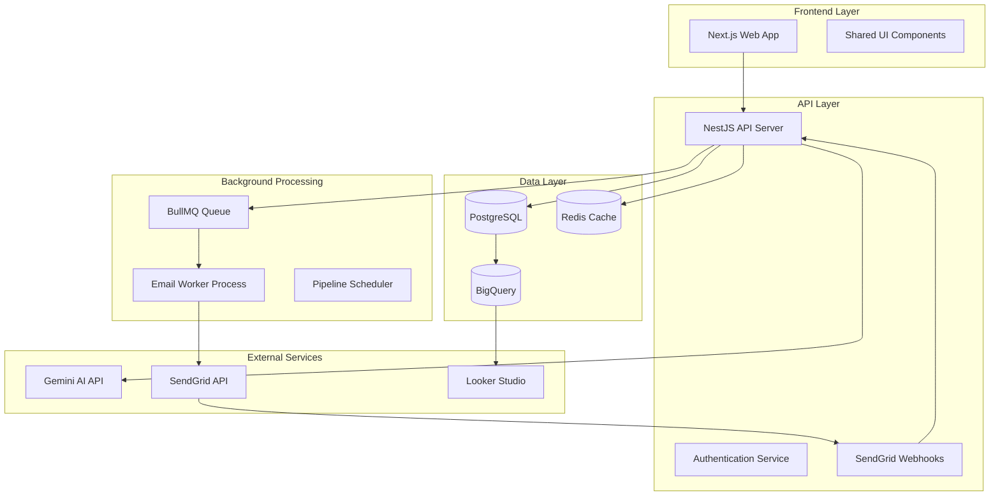

### Component Architecture

#### Frontend Components Hierarchy

```
App Layout
├── Authentication
│   ├── LoginForm
│   ├── SignupForm
│   └── UserProfile
├── Dashboard
│   ├── MetricCards
│   ├── RecentActivity
│   └── QuickActions
├── Lead Management
│   ├── LeadUpload
│   ├── LeadList
│   ├── LeadDetails
│   └── BulkActions
├── Pipeline Builder
│   ├── PipelineCanvas
│   ├── StepEditor
│   ├── ConditionBuilder
│   └── TemplateEditor
├── Email Composer
│   ├── AIAssistant
│   ├── TemplateLibrary
│   ├── PreviewPane
│   └── TestSender
├── Analytics
│   ├── PerformanceDashboard
│   ├── EngagementCharts
│   ├── ConversionFunnels
│   └── ReportBuilder
└── Settings
    ├── CompanyProfile
    ├── EmailSettings
    ├── IntegrationConfig
    └── DeliverabilityHealth
```

### Data Models & Database Schema

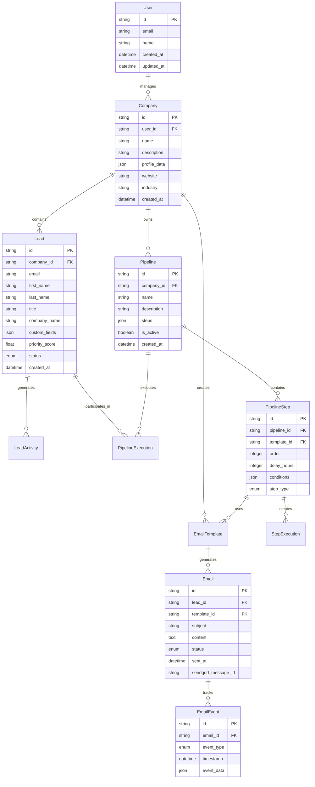

### API Endpoints Reference

#### Authentication Endpoints

| Method | Endpoint         | Description         |
| ------ | ---------------- | ------------------- |
| POST   | `/auth/register` | User registration   |
| POST   | `/auth/login`    | User authentication |
| POST   | `/auth/logout`   | User logout         |
| GET    | `/auth/me`       | Get current user    |

#### Lead Management Endpoints

| Method | Endpoint             | Description                |
| ------ | -------------------- | -------------------------- |
| POST   | `/leads/upload`      | Upload CSV leads           |
| GET    | `/leads`             | List leads with pagination |
| GET    | `/leads/:id`         | Get lead details           |
| PUT    | `/leads/:id`         | Update lead information    |
| DELETE | `/leads/:id`         | Delete lead                |
| POST   | `/leads/bulk-assign` | Assign leads to pipeline   |

#### Pipeline Management Endpoints

| Method | Endpoint               | Description              |
| ------ | ---------------------- | ------------------------ |
| GET    | `/pipelines`           | List all pipelines       |
| POST   | `/pipelines`           | Create new pipeline      |
| GET    | `/pipelines/:id`       | Get pipeline details     |
| PUT    | `/pipelines/:id`       | Update pipeline          |
| DELETE | `/pipelines/:id`       | Delete pipeline          |
| POST   | `/pipelines/:id/start` | Start pipeline for leads |

#### Email Generation & Sending Endpoints

| Method | Endpoint            | Description               |
| ------ | ------------------- | ------------------------- |
| POST   | `/emails/generate`  | Generate AI email content |
| POST   | `/emails/send`      | Send individual email     |
| GET    | `/emails/templates` | List email templates      |
| POST   | `/emails/templates` | Create email template     |

#### Analytics Endpoints

| Method | Endpoint                 | Description           |
| ------ | ------------------------ | --------------------- |
| GET    | `/analytics/dashboard`   | Get dashboard metrics |
| GET    | `/analytics/performance` | Get performance data  |
| POST   | `/analytics/export`      | Export analytics data |

#### Webhook Endpoints

| Method | Endpoint             | Description            |
| ------ | -------------------- | ---------------------- |
| POST   | `/webhooks/sendgrid` | Handle SendGrid events |

### Business Logic Layer

#### Lead Processing Architecture

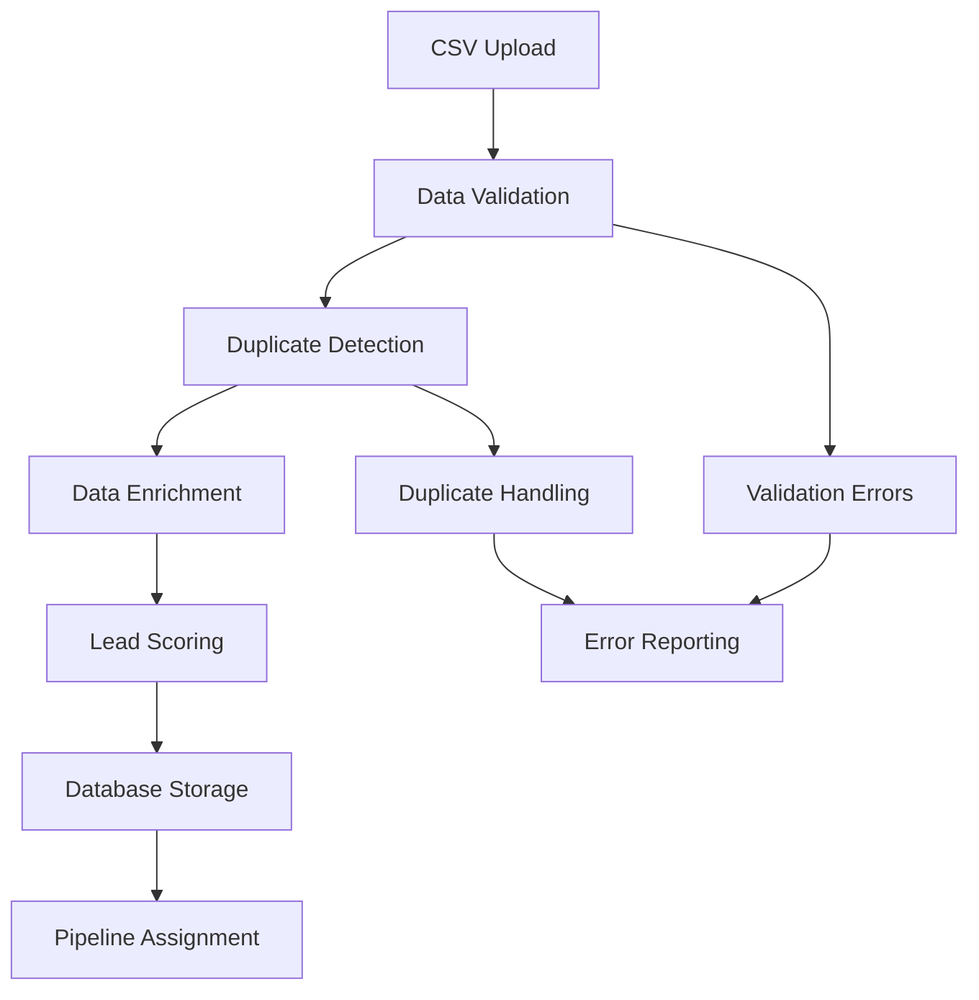

#### Email Generation Workflow

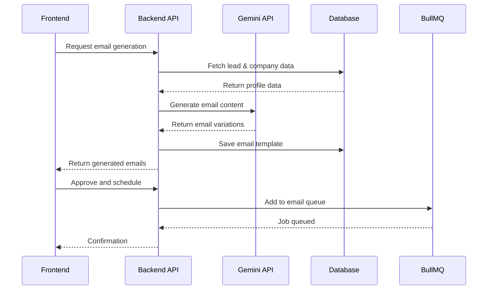

#### Pipeline Execution Engine

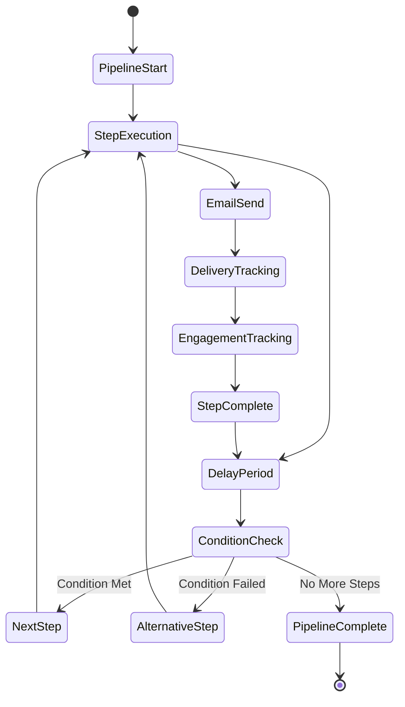

### Middleware & Background Processing

#### Queue Management Architecture

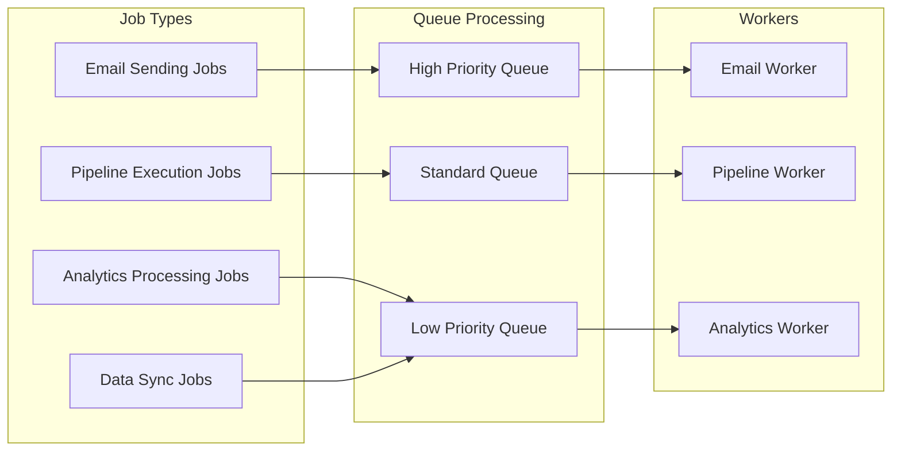

#### Rate Limiting Strategy

| Service           | Limit Type      | Rate     | Implementation         |
| ----------------- | --------------- | -------- | ---------------------- |
| SendGrid API      | Requests/second | 600/sec  | BullMQ rate limiter    |
| Gemini API        | Requests/minute | 60/min   | Redis-based throttling |
| CSV Upload        | File size       | 10MB max | Express middleware     |
| Pipeline Creation | Per user/hour   | 50/hour  | Redis counter          |

### Analytics & Data Pipeline

#### Data Flow Architecture

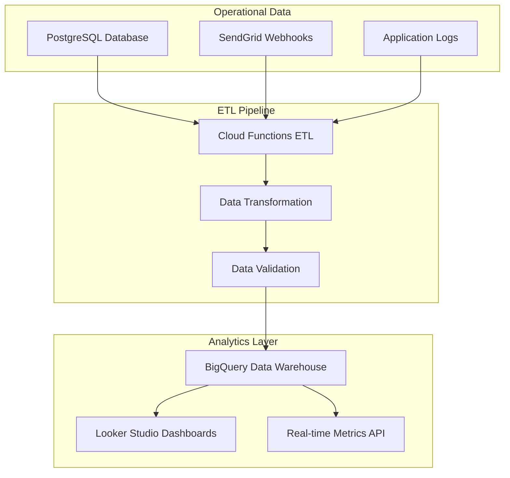

#### Key Performance Indicators (KPIs)

| Metric Category      | KPI                 | Calculation                           | Source          |
| -------------------- | ------------------- | ------------------------------------- | --------------- |
| Email Performance    | Open Rate           | (Opens / Sent) × 100                  | SendGrid Events |
| Email Performance    | Click Rate          | (Clicks / Sent) × 100                 | SendGrid Events |
| Email Performance    | Reply Rate          | (Replies / Sent) × 100                | SendGrid Events |
| Pipeline Performance | Conversion Rate     | (Conversions / Pipeline Starts) × 100 | Database        |
| Lead Quality         | Engagement Score    | Weighted sum of interactions          | Calculated      |
| System Performance   | Email Delivery Rate | (Delivered / Sent) × 100              | SendGrid Events |

### Testing Strategy

#### Testing Pyramid

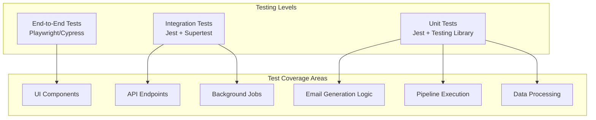

#### Test Data Management

- **Mock Services**: Mock Gemini API and SendGrid for testing
- **Test Database**: Separate PostgreSQL instance with test data
- **Fixture Management**: JSON fixtures for consistent test data
- **Email Testing**: Use SendGrid sandbox mode for integration tests

### Security & Authentication

#### Authentication Flow

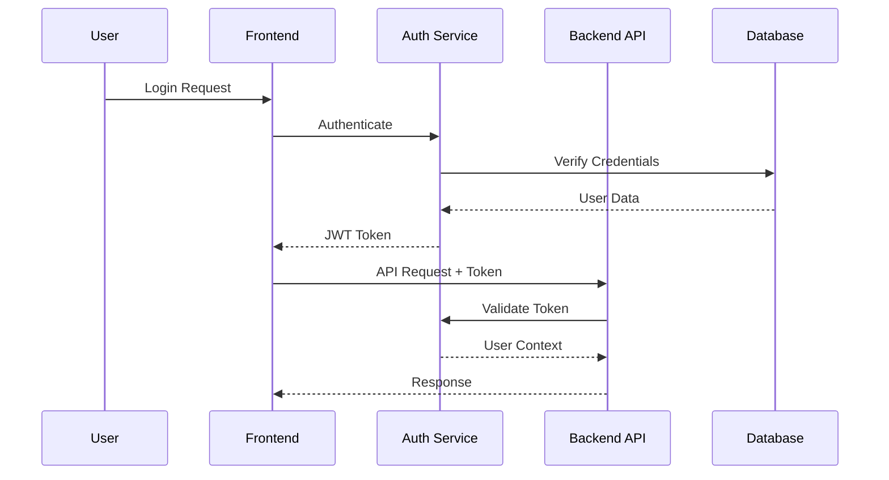

#### Security Measures

- **JWT Token Authentication** with refresh token rotation
- **Role-Based Access Control (RBAC)** for multi-user companies
- **API Rate Limiting** to prevent abuse
- **Input Validation** using Joi/Zod schemas
- **SQL Injection Protection** through Prisma ORM
- **CORS Configuration** for cross-origin requests
- **Environment Variable Management** for sensitive data

### Deployment & Infrastructure

#### Cloud Infrastructure (GCP)

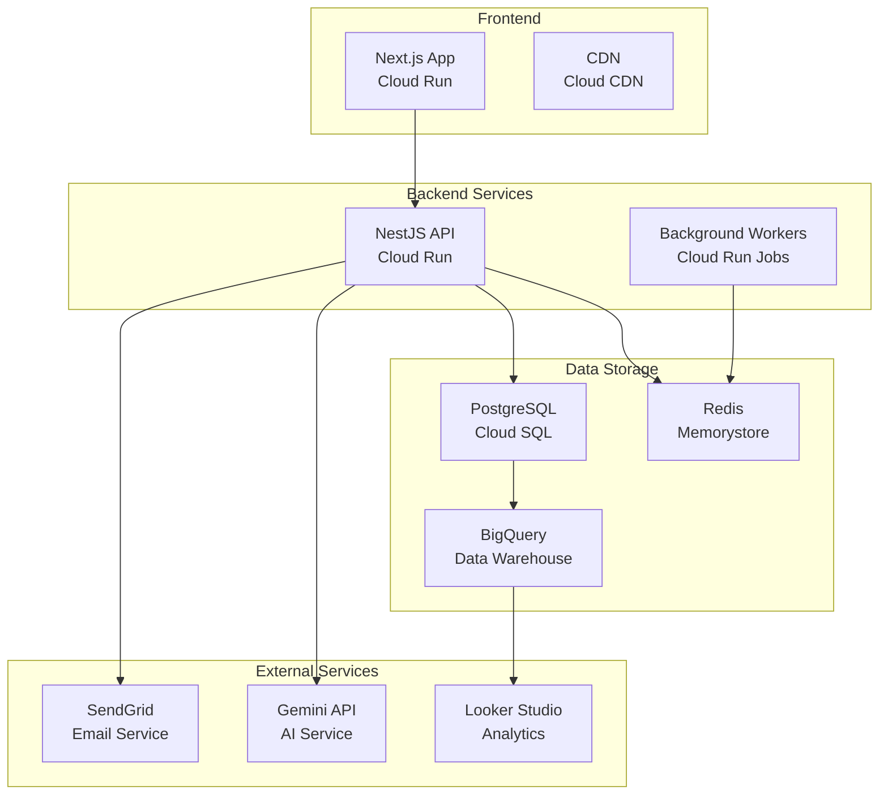

#### Container Strategy

- **Docker Images**: Multi-stage builds for optimized production images
- **Artifact Registry**: Store and version container images
- **Health Checks**: Configure proper health check endpoints
- **Resource Limits**: Set appropriate CPU and memory limits
- **Auto-scaling**: Configure based on CPU/memory usage and queue depth

#### CI/CD Pipeline

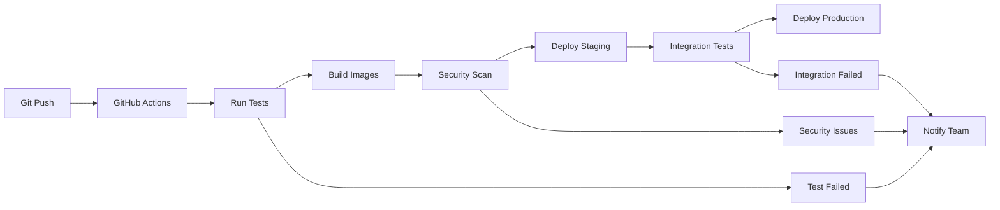

### Phase Implementation Strategy

#### Phase 1: Core MVP (Weeks 1-4)

- User authentication and company profile setup
- Basic lead upload and management
- AI email generation (single emails)
- Manual email sending via SendGrid
- Basic email tracking

#### Phase 2: Automation & Pipelines (Weeks 5-8)

- Pipeline builder UI with drag-and-drop interface
- BullMQ job queue setup for background processing
- Automated email scheduling and sending
- Step conditions and branching logic
- Template management system

#### Phase 3: Analytics & Intelligence (Weeks 9-12)

- SendGrid webhook integration for real-time events
- BigQuery data pipeline setup
- Looker Studio dashboard creation
- Lead scoring algorithm implementation
- Performance analytics and reporting

#### Phase 4: Scaling & Optimization (Weeks 13-16)

- Advanced rate limiting and throttling
- Email warm-up scheduling features
- Deliverability health monitoring
- A/B testing framework
- Advanced analytics and AI insights

### Error Handling & Monitoring

#### Error Handling Strategy

- **Global Exception Filters** for consistent error responses
- **Validation Pipes** for request data validation
- **Retry Mechanisms** for external API failures
- **Circuit Breaker Pattern** for resilient service communication
- **Dead Letter Queues** for failed background jobs

#### Monitoring & Observability

- **Application Metrics**: Response times, error rates, throughput
- **Business Metrics**: Email delivery rates, engagement metrics
- **Infrastructure Metrics**: CPU, memory, database performance
- **Log Aggregation**: Structured logging with correlation IDs
- **Alerting**: Automated alerts for critical issues and thresholds
